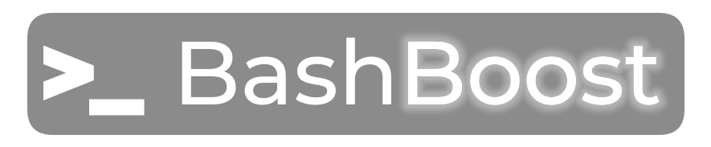

<br/>
<p align="center">
  <a href="https://github.com/Pixel-Pirate-Team/bashboost-scripts">
    
  </a>

  <h3 align="center">Bashboost</h3>

  <p align="center">
    A collection of shell/bash scripts to automate processes. They have been designed for Debian Linux.
    <br/>
    <br/>
    <a href="https://github.com/Pixel-Pirate-Team/bashboost-scripts"><strong>Explore the docs »</strong></a>
    <br/>
    <br/>
    <a href="https://github.com/Pixel-Pirate-Team/bashboost-scripts">View Demo</a>
    .
    <a href="https://github.com/Pixel-Pirate-Team/bashboost-scripts/issues">Report Bug</a>
    .
    <a href="https://github.com/Pixel-Pirate-Team/bashboost-scripts/issues">Request Feature</a>
  </p>
</p>

    

## About The Project


Doing things as simple as updating a program can become time consuming if the program developers do not do their job correctly. Sometimes silly things like deleting the list of recent files can be a process that requires some googling before doing so, and therefore a lot of time wasted in performing these tasks.
That's exactly why **BashBoost** is here! A collection of shell scripts that will allow you to automate tasks in your Debian. They may also work on other systems, but compatibility is not assured.
Here is a small list of what our scripts are capable of doing:
* Clear the list of recent files
* Update programs like Discord


## Built With

This section should list any major frameworks that you built your project using. Leave any add-ons/plugins for the acknowledgements section. Here are a few examples.

## Getting Started

This is an example of how you may give instructions on setting up your project locally.
To get a local copy up and running follow these simple example steps.

### Prerequisites

This is an example of how to list things you need to use the software and how to install them.

* npm

```sh
npm install npm@latest -g
```

### Installation

1. Get a free API Key at [https://example.com](https://example.com)

2. Clone the repo

```sh
git clone https://github.com/your_username_/Project-Name.git
```

3. Install NPM packages

```sh
npm install
```

4. Enter your API in `config.js`

```JS
const API_KEY = 'ENTER YOUR API';
```

## Usage

Use this space to show useful examples of how a project can be used. Additional screenshots, code examples and demos work well in this space. You may also link to more resources.

_For more examples, please refer to the [Documentation](https://example.com)_

## Roadmap

See the [open issues](https://github.com/Pixel-Pirate-Team/bashboost-scripts/issues) for a list of proposed features (and known issues).

## Contributing

Contributions are what make the open source community such an amazing place to be learn, inspire, and create. Any contributions you make are **greatly appreciated**.
* If you have suggestions for adding or removing projects, feel free to [open an issue](https://github.com/Pixel-Pirate-Team/bashboost-scripts/issues/new) to discuss it, or directly create a pull request after you edit the *README.md* file with necessary changes.
* Please make sure you check your spelling and grammar.
* Create individual PR for each suggestion.
* Please also read through the [Code Of Conduct](https://github.com/Pixel-Pirate-Team/bashboost-scripts/blob/main/CODE_OF_CONDUCT.md) before posting your first idea as well.

### Creating A Pull Request

1. Fork the Project
2. Create your Feature Branch (`git checkout -b feature/AmazingFeature`)
3. Commit your Changes (`git commit -m 'Add some AmazingFeature'`)
4. Push to the Branch (`git push origin feature/AmazingFeature`)
5. Open a Pull Request

## License

Distributed under the MIT License. See [LICENSE](https://github.com/Pixel-Pirate-Team/bashboost-scripts/blob/main/LICENSE.md) for more information.

## Authors

* **Shaan Khan** - *Comp Sci Student* - [Shaan Khan](https://github.com/ShaanCoding/) - *Built ReadME Template*

## Acknowledgements

* [ShaanCoding](https://github.com/ShaanCoding/)
* [Othneil Drew](https://github.com/othneildrew/Best-README-Template)
* [ImgShields](https://shields.io/)
